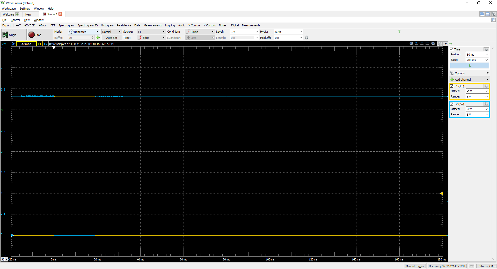

# ChemImage LCTF Hardware Triggering

## Overview

The ChemImage LCTF has an external connector that provides triggering output signals. The connector is located next to the USB connector. The connector is a JST SM08B-GHS-TB and mates with a [JST GHR-08V-S](https://www.digikey.com/product-detail/en/jst-sales-america-inc/GHR-08V-S/455-1598-ND).

There is no trigger input at this time.

## Connector Pinout

| Pin | Name | Behavior |
|--|--|
|1 (Closest to USB)| GND | LCTF ground. |
|2 | T1 | High during tuning, low when not. |
|3 | T2 | Low during tuning, high when not. |
|4 | GND | LCTF ground. |
|5 | N/A | Not used. |
|6 | N/A | Not used. |
|7 | N/A | Not used. |
|8 | 3.3V | 3.3V reference voltage.

## Trigger Behavior

T1 and T2 have opposite outputs, so either can be selected depending on if your application prefers triggering on a rising or falling edge. T1 (yellow) and T2 (blue) are shown in the oscilloscope trace below for a tuning event starting at the 0ms mark.

## Support
If support for hardware triggering is needed, you can submit an issue
[here](https://github.com/ChemImageFT/ChemImageLctfSdk/issues/new) or email us at: [LCTFSupport@chemimage.com](mailto:LCTFSupport@chemimage.com).